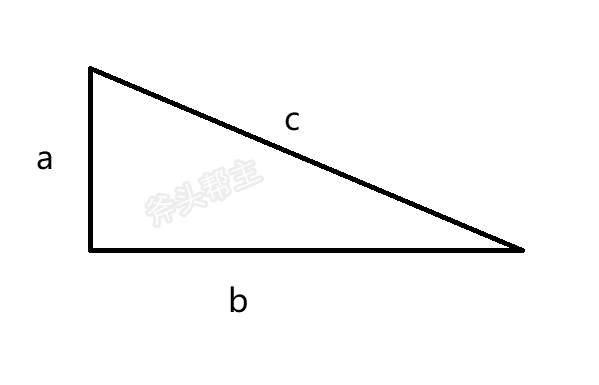
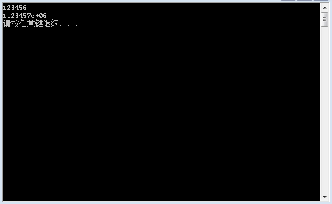

# 数据结构与算法 _ Z1


本阶段课程主要针对于基础语法、数学、算法进行详细讲解


## 1 算术运算符


### 1.1 常用运算符


**作用：**用于处理四则运算 


常用算术运算符包括以下符号：

| **运算符** | **术语**   | **示例** | **结果** |
| ---------- | ---------- | -------- | -------- |
| +          | 加         | 10 + 5   | 15       |
| -          | 减         | 10 - 5   | 5        |
| *          | 乘         | 10 * 5   | 50       |
| /          | 除         | 10 / 5   | 2        |
| %          | 取模(取余) | 10 % 3   | 1        |


**参考代码：**

```C++
//除法运算
void test01()
{
	int a1 = 10;
	int b1 = 3;

	//1 两个int 相除后 结果还是int类型
	cout << a1 / b1 << endl;

	//2、除数不可以为0
	int a2 = 10;
	int b2 = 0;
	//cout << a2 / b2 << endl;

	//3、两个浮点型数据 可以相除
	double d1 = 10.5;
	double d2 = 2.5;
	cout << d1 / d2 << endl;
}

//取模运算
void test02()
{
	int a1 = 10;
	int b1 = 3;

	cout << a1 % b1 << endl;

	int a2 = 10;
	int b2 = 0;

	//cout << a2 % b2 << endl;

	//两个小数不可以取模
	double d1 = 1.1;
	double d2 = 2.2;
	//cout << d1 % d2 << endl;
}
```


> 注意1：在除法运算中，除数不能为0

> 注意2：只有整型变量变量可以进行取模运算


### 1.2  常用操作

#### 1.2.1 取数位


**题目描述：**

获取一个三位数的个位与十位与百位


**思路分析：**

*   获得个位：整数本身使用 % 模 10
*   获得十位：整数本身使用 / 除以 10，再使用 % 模10。

*   获得百位：整数本身使用 / 除以 100


**参考代码：**

```cpp
//1 取数位
void test01()
{
	int n;
	cin >> n;

	cout << "个位： " << n % 10 << endl;
	cout << "十位： " << (n / 10) % 10 << endl;
	cout << "十位： " << n % 100 / 10 << endl;
	cout << "百位： " << n / 100 << endl;

}
```


#### 1.2.2  数位和


**题目描述：**

输入一个不超过int类型的整数，求各个位上数字之和


```
输入： 123
输出： 6
```


**思路分析：**

*   当前数字不断进行取个位和去个位操作，直至数字为0


**参考代码：**

```C++
//2 数位和
void test02()
{
	int n;
	cin >> n;

	int sum = 0; 

	while (n)
	{
		sum += n % 10;  //取个位
		 
		n /= 10;   //去个位
	}

	cout << "数位之和为： " << sum << endl;
}
```


#### 1.2.3 反转数字

**题目描述：**

输入一个不超过int类型的整数，求反转后的数字

```C
输入： 123
输出： 321
```


**思路解析：**

*   创建保存结果变量sum，初始化 0
*   将sum 乘以10  +  该数字的个位
*   去除个位,循环执行上一步，直至该数字为0


**参考代码：**

```C++
//3 反转数字
void test03()
{
	int n;
	cin >> n;

	int sum = 0;

	while (n)
	{
		sum = sum * 10 + n % 10;
		n /= 10; 
	}

	cout << "反转后的数字为： " << sum << endl;
}

```


## 2 阶乘末尾0的个数


### 2.1 阶乘

**阶乘定义：**


​	**阶乘**  是基斯顿·卡曼（Christian Kramp，1760～1826）于 1808 年发明的运算符号，是数学术语


*   一个正整数的**阶乘**是所有小于及等于该数的正整数的积
*   0的阶乘为1
*   自然数n的阶乘写作  ==**n!**==


**公式：**


*   **n!= 1 × 2 × 3 × . . . × ( n - 1 ) × n**
*   **n! = n * (n - 1)!**
*   **0! = 1**


**举例：  5! = 1 * 2 * 3 * 4 * 5 = 120 **


**题目描述：**

输入一个正整数n(  1 <= n <= 20 ) ,求n的阶乘


**参考代码一：**

```c++
//1 阶乘
void test01()
{
	//求n的阶乘
	int  n;
	cin >> n;

	long long res = 1;

	for (int i = 1; i <= n; i++)
	{
		res *= i;
	}

	cout << n << "! = " << res << endl;
}
```


**参考代码二：**

```c++
//2 阶乘的第二种解法
void test02()
{
	//求n的阶乘
	int n;
	cin >> n;

	long long arr[100] = { 0 };

	arr[0] = 1;

	// 利用下标 保存对应的数字 阶乘的结果
	for (int i = 1; i <= n; i++)
	{
		arr[i] = arr[i - 1] * i;
	}

	cout << n << "! = " << arr[n] << endl;
}
```


### 2.2 阶乘末尾零的个数  _ 1


顾名思义，题目的含义是要求n！末尾所含 **0的个数**

*    5! =  120               								 末尾  1 个 0 
*    10！ =   3628800   	 				         末尾  2 个 0
*    15！ =  1307674368000                     末尾  3 个 0
*    20！ =  2432902008176640000        末尾  4 个 0


**思路分析：**

计算出阶乘的结果后，取出个位，统计0的个数


**题目描述：**

输入一个正整数n ,求n的阶乘末尾0的个数


**参考代码：**

```C++
void test01() {

    //求n的阶乘
    int n = 0;
    cin >> n;

    long long res = 1;
    for (int i = 1; i <= n; i++) {
        res *= i;
    }
    cout << n << "! = " << res << endl;

    int num = 0;
    while (res % 10 == 0) {
        num++;
        res /= 10;
    }

    cout << n << "! 末尾0的个数为： " << num << endl;
}
```


**缺点：** long long 表示范围 2^63 - 1 (19位数) ,21!已到20位，溢出后无法准确计算。


### 2.3 阶乘末尾零的个数 _ 2


**思路分析：**

*   末尾的0说明该数字是合数（不是质数）
*   合数都可以拆分为多个质数相乘
*   质数相乘结果能产生尾数0，只可能是 2 * 5 


**举例：**

*   4 * 25  = 2² * 5² = （2 * 5）²
*   8 * 125 = 2³ * 5³ = （2 * 5）³


**结论：**

*   尾数0的个数取决于2和5的因子个数
*   阶乘中每连续的两个数字就会有一个因子2，所以因子2无需考虑
*   5因子的个数    ->    阶乘末尾0的个数


**参考代码：**

```c++
void test02()
{
    int n = 0;
    cin >> n;

    int temp = 0;
    int num = 0;
    for (int i = 1; i <= n; i++)
    {
        temp = i;
        while (temp % 5 == 0)
        {
            num++;
            temp /= 5;
        }
    }

    cout << n << "! 末尾0的个数为： " << num << endl;
}
```


**优点：** 可以计算超过long long类型数字阶乘的末尾0的个数了

**缺点：** 复杂度高，遍历过程中，无用数字过多


### 2.4 阶乘末尾零的个数 _ 3


**思路分析：**

*   解法二的基础上进行优化

*   无需遍历所有的数字，只需要5的倍数即可


**参考代码：**

```c++
void test03()
{
    int n = 0;
    cin >> n;

    int temp = 0;
    int num = 0;
    for (int i = 5; i <= n; i+=5)
    {
        temp = i;
        while (temp % 5 == 0)
        {
            num++;
            temp /= 5;
        }
    }

    cout << n << "! 末尾0的个数为： " << num << endl;
}
```


**优点：** 过滤掉阶乘中无用数字的检测

**缺点：** 复杂度高


### 2.5 阶乘末尾零的个数 _ 4

**思路分析：**

*   每一个5的倍数都可以至少贡献出 **1个** 5因子
*   每一个25的倍数都可以至少贡献出 **2个** 5因子
*   每一个125的倍数都可以至少贡献出 **3个** 5因子
*   阶乘末尾0   ->   贡献1个5因子个数 + 贡献2个5因子个数 +  贡献3个5因子个数 + . . . + 贡献n个5因子个数 


**举例：**

求 56！ 末尾0的个数

*   56 / 5 = 11
*   11 / 5 = 2
*   2 / 5 = 0

结果为： `11 + 2 = 13个`


**参考代码：**

```C++
void test04()
{
    int n = 0;
    cin >> n;

    int num = 0;
    while (n) {  
        num += n / 5;
        n = n / 5;
    }
    cout << n << "! 末尾0的个数为： " << num << endl;
}
```


**优点：**代码简洁，复杂度低


## 3 质数与合数

### 3.1 质数与合数定义

**质数（素数）定义：**

*   一个大于1的自然数
*   除了1和它本身，不能被其他自然数整除


**举例：**

*   2 3 5 7 11 13 ...


**合数定义：**

*   一个大于1的自然数
*   除了1和它本身，能被其他自然数整除


>   注1： 1 既不是质数也不是合数

>   注2：如果n能被m整除，称n是m的倍数，m是n的因数（约数）


### 3.2 质数的判断

给定一个数字n，如何判断它是否是质数呢？


**思路分析：**

从2开始逐个数字进行遍历，查看n能否被这个数字整除

如果在2~ n-1之间找到了n的因数，说明该数字不是质数

否则该数字是质数


>   注： 如果传入数字是1，既不是质数也不是合数


**题目描述：**输入一个正整数 N，范围在 2 到1000000000 之间。当数字 N 是质数时，输出  "质数" ，否则输出 "合数"。


**参考代码：**

```C++
/*
输入一个正整数 N，范围在 2 到1000000000 之间。当数字 N 是质数时，
输出  "质数" ，否则输出 "合数"。
*/
void test01()
{
	long long n;
	cin >> n;

	bool flag = true;

	for (int i = 2; i < n; i++)
	{
		if (n % i == 0)
		{
			flag = false;
			break;
		}
	}

	if (flag)
	{
		cout << "质数" << endl;
	}
	else
	{
		cout << "合数" << endl;
	}

}  
```


### 3.3 质数判断优化

**优化目的：**缩小枚举范围


**思路分析：**

*   假设数字n是合数，一定可以写成 a * b = n 的公式
*   设 a <= b  
*   a * a   <=  a * b  = n
*   a <=  $$ \sqrt{n} $$


**结论：**

*   如果n是合数，那么一定可以找到不超过  $$ \sqrt{n} $$  的因数


**效率：**

例如数字 100000007（大质数），优化后节省1万倍的计算


**题目描述：**

输入一个正整数 N，范围在 2 到1000000000 之间。当数字 N 是质数时，输出  "质数" ，否则输出 "合数"。


**参考代码：**

```C++
/* 输入一个正整数 N，范围在 2 到1000000000 之间。当数字 N 是质数时，输出  "质数" ，否则输出 "合数。*/
void test01()
{
    long long n = 0;
    bool flag = true;
    cin >> n;

    for (int i = 2; i * i <= n; i++)
    {
        if (n % i == 0)
        {
            cout << i << endl;
            flag = false;
            break;
        }
    }
    if (flag)
    {
        cout << "质数" << endl;
    }
    else
    {
        cout << "合数" << endl;
    }

}    
```


### 3.4 多个数字的质数性质判定


之前的案例每次运行程序只能完成一次质数的判定

设计程序，运行后可以实现 多个数字的质数性质判定 


**题目描述：**

判断n个数字m的是否为质数，其中(1 <= n <= 1000) ( 2 <= m <= 1000000000 )

```
输入格式:
	输入有两行，第一行是一个整数 n，表示需要判断的数字的个数
	接下来输入 n 个数字，表示需要判断数值 m
输出格式：
	输出有 n 行，每行输出对应m是否为质数，如果是，输出  "质数" ，否则输出 "合数"
```


**参考代码：**

```C++
void test01()
{
    int n = 0;  //判断次数
    int m = 0;  //判断的数字
    cin >> n; 

    for (int i = 1; i <= n; i++)
    {
        // 判断 m 是否为质数
        cin >> m;
        bool flag = true;
        for (int j = 2; j * j <= m; j++) {
            if (m % j == 0) {
                flag = false;
                break;
            }
        }
        if (flag) {
            cout << "质数" << endl;
        }
        else
        {
            cout << "合数" << endl; 
        }
    }
}
```

**缺点：**每个数字逐个需要判断，如果询问次数较大，相当耗时


### 3.5 埃氏筛法


#### 3.5.1 埃氏筛法原理：


**学习目的：**优化多次询问质数时，时间上的消耗


**定义：**埃拉托斯特尼筛法，简称**埃氏筛**或**爱氏筛**，是一种由希腊数学家埃拉托斯特尼所提出的一种判断素数的算法


**算法解析：**

*   利用数组，预处理一段区间内质数的性质
*   假设2到待判定数字N所有数字都是质数
*   从 i = 2开始遍历，2i, 3i , 4i ... ki 肯定不是质数，因为有i因子
*   将所有不是质数的数字标记出来，剩下的就是质数


**核心代码：**

```CPP
bool is_prime[101] = {0};
for (int i = 2; i <= n; i++) {
    is_prime[i] = true;
}
for (int i = 2; i <= n; i++) {   //从2开始到n找质数
    for (int j = i * 2; j <= n; j += i) {  
        is_prime[j] = false;
    }  
}
```


**核心代码优化思路：**

1、质数做筛选，合数不用了
2、内层循环从   **j = i * 2**  优化为  **j = i * i**
3、 i 从 2 到  i * i <= n 进行筛选


**核心代码优化：**

```CPP
bool is_prime[101] = {0};
for (int i = 2; i <= n; i++) {
    is_prime[i] = true;
}

for (int i = 2; i * i <= n; i++) {
    if (is_prime[i]) {
        for (int j = i * i; j <= n; j += i) {
            is_prime[j] = false;
        }
    }
}
```


#### 3.5.2 埃氏筛法实现


**题目描述：**

利用埃氏筛法，输出100以内的所有质数


**参考代码：**

```CPP
void test01()
{
    bool is_prime[101] = { 0 };
    for (int i = 2; i <= 100; i++) {
        is_prime[i] = true;
    }

    for (int i = 2; i * i <= 100; i++) {
        if (is_prime[i]) {
            for (int j = i * i; j <= 100; j += i) {
                is_prime[j] = false;
            }
        }
    }

    for (int i = 2; i <= 100; i++)
    {
        if (is_prime[i])
        {
            cout << i << endl;
        }
    }
}
```


### 3.6 帮主的拷问

**题目描述：**

帮主抓到了一个别的帮派的卧底，仁慈的帮主给了卧底一条生路，让卧底设计个程序才可以离开

程序中需要回答帮主m次的询问，每次帮主会问[1,n]范围内第x个质数是几？程序需要快速输出结果

趁帮主不在的时候卧底求助与你，请你帮忙设计这个程序,输入输出格式如下：

```
输入格式
	第一行包含两个正整数 n, m，分别表示 查询的范围 和 查询次数 。
	接下来 m 行,每行一个正整数 x，表示待查询的第 x 个质数。
    (1 <= n <= 10^5)  (1 <= m <= 10^5)  保证查询的x在有效范围内
输出格式
	输出 m 行，每行一个正整数表示答案
```


**参考代码：**

```CPP
int main() {

    bool is_prime[100001] = { 0 };
    int arr[100001] = { 0 };

    int n, m; //n 查询的范围   m 询问次数
    cin >> n >> m;

    for (int i = 2; i <= n; i++)
    {
        is_prime[i] = true;
    }

    for (int i = 2; i * i <= n; i++)
    {
        if (is_prime[i])
        {
            for (int j = i * i; j <= n; j += i)
            {
                is_prime[j] = false;
            }
        }
    }

    int index = 0;
    for (int i = 2; i <= n; i++)
    {
        if (is_prime[i])
        {
            arr[index] = i;
            index++;
        }
    }

    for (int i = 0; i < m; i++)
    {
        int num;
        cin >> num;

        cout << "第 " << num << "个质数是： " << arr[num - 1] << endl;
    }


	system("pause");
	return EXIT_SUCCESS;
}
```


## 4 随机数  


### 4.1 rand函数


**作用： **    产生随机数

**头文件： **#include\<cstdlib>   

**函数原形：**int rand(void)

>   注：  VS中 #include<iostream> 已包含了 <cstdlib> 因此无需特意包含


**举例：**

*   利用rand产生10个随机数


**参考代码：**

```C++
void test01()
{
    for (int i = 0; i < 10; i++)
    {
        cout << rand() << endl;
    }
}
```

**结论：**多次运行，发现每次结果都是一样的，并非真正的随机数


### 4.2  srand函数

为什么每次生成的随机数都是一样的呢？

**原因：**

*   随机数生成需要依赖于随机数种子
*   系统默认的随机数种子为1
*   生成的随机数在 0 ~ MAX 之间
*   Windows上的MAX是 ==32767==
*   Linux上MAX的值为==2 <sup>32</sup> -1==

**结论：**

*   修改随机数种子，就可以获得真正的随机数


**srand函数作用：**设置随机数种子

**头文件： **#include\<cstdlib>   

**函数原形：**void srand(seed)

>   注：  VS中 #include<iostream> 已包含了 <cstdlib> 因此无需特意包含


**参考代码：**

```CPP
void test02()
{
    for (int i = 0; i < 10; i++)
    {
        srand(i*1000);
        cout << rand() << endl;
    }
}
```

**结论：**生成的还是伪随机数，因为每次运行程序随机数种子也是一样的


### 4.3 time函数


**功能：**返回1970年1月1日 00:00:00 至今的秒数


**用法：** time(NULL)


**头文件： **#include\<ctime>   


>   注：  VS中 #include<iostream> 已包含了 <ctime> 因此无需特意包含


**常用语法：**

`srand((unsigned int)time(NULL));`


**参考代码：**

```CPP
void test03()
{
    srand((unsigned int)time(NULL));
    for (int i = 0; i < 10; i++)
    {
        cout << rand() << endl;
    }
}
```

**结论：**可以产生真正的随机数啦！


### 4.4 随机数范围

**思考：** 下面的代码中，假设a是无限大的正整数，b也是无限大吗？如果不是，b的范围是多少？


```CPP
int a;
cin >> a;
int b = a % 10;
cout << b << endl;
```


**结论：**通过取模运算，我们可以控制随机数的范围


**举例：**

*   int num1 = rand() % 100;   
*   int num2 = rand() % 1000;   
*   int num3 = rand() % 100 + 1;  


**提问：**

*   生成 5 ~ 10 的随机数代码怎么写
*   生成 100 ~ 1000 的随机数代码怎么写
*   生成 随机的2位数代码怎么写


**参考代码：**

```CPP
void test04() {

	srand((unsigned int)time(NULL));

	cout << "5 ~ 10的随机数： " << rand() % 6 + 5 << endl;

	cout << "100 ~ 1000的随机数： " << rand() % 901 + 100 << endl;

	cout << "随机的两位数： " << rand() % 90 + 10 << endl;
}
```


### 4.5 帮主的猜数字

**题目描述：**

年底要开年会了，帮主为了犒劳本帮派的所有弟兄们，搞了一个猜数字的环节，帮主找到你帮忙设计一下这个程序，游戏规则如下：

*   猜出系统生成的随机数，游戏开始有选择难度的提示

*   游戏分为3个难度：简单、中等、困难
*   简单难度，程序随机生成一个两位数
*   中等难度，程序随机生成一个三位数
*   困难难度，程序随机生成一个四位数
*   玩家有10次猜测的机会，猜错系统会提示猜大了或猜小了
*   如果猜对，做出相应提示，简单获得100元，中等获得1万元，困难带薪休假1年，并结束游戏
*   10次机会用尽，提示游戏结束


```C++
输入格式
	第一行一个正整数select,代表玩家选择的难度。
	接下来输入val进行猜测。
输出格式
	根据玩家猜测的结果，提示不同的信息
```


**参考代码：**

```CPP
#define _CRT_SECURE_NO_WARNINGS
#include<iostream>
using namespace std;

void menu()
{
	cout << "请选择游戏难度： " << endl;
	cout << "1、简单(两位数)" << endl;
	cout << "2、中等(三位数)" << endl;
	cout << "3、困难(四位数)" << endl;
}

int main() {

	//设置随机数种子
	srand((unsigned int)time(NULL));

	int select = 0;
	int random = 0;

	//1、产生随机数
	
	bool flag = true;
	while (flag) {

		menu();

		cout << "请输入您的选择： " << endl;
		cin >> select;

		switch (select)
		{
		case 1:
			random = rand() % 90 + 10; // 10 ~ 99
			flag = false;
			break;
		case 2:
			random = rand() % 900 + 100; // 100 ~ 999
			flag = false;
			break;
		case 3:
			random = rand() % 9000 + 1000; // 1000 ~ 9999
			flag = false;
			//cout << "标志位： " << cin.fail() << endl;
			break;
		default:
			cout << "输入有误，请重新输入： " << endl;
			system("pause");
			system("cls");

			//重置标志位
			cin.clear();

			//刷新缓冲区
			cin.sync();
			
			char buf[1024] = { 0 };
			cin.getline(buf, sizeof(buf));

			//cout << "标志位： " << cin.fail() << endl;

			break;
		}
	}

	bool win = false; //猜测结果
	//cout << random << endl;

	//2、玩家猜测
	int val = 0;
	for (int i = 0; i < 10; i++)
	{
		cout << "请输入数字进行猜测： " << endl;
		cout << "您还有 《 " << 10 - i << " 》次机会" << endl;

		cin >> val;

		if (random == val)
		{
			win = true;
			break;
		}
		else if (random > val)
		{
			cout << "很遗憾，您猜小了" << endl;
		}
		else
		{
			cout << "很遗憾，您猜大了" << endl;
		}
	}

	//3、结果提示
	if (win)
	{
		cout << "恭喜您，您猜对了~" << endl;
		if (select == 1)
		{
			cout << "您获得了100元奖励！" << endl;
		}
		else if (select == 2)
		{
			cout << "您获得了1万元奖励！" << endl;
		}
		else 
		{
			cout << "您可以带薪休假1年，明白不用上班了！" << endl;
		}
	}
	else
	{
		cout << "机会用尽，来年继续加油吧" << endl;
	}
	cout << "游戏结束" << endl;

	system("pause");
	return EXIT_SUCCESS;
}
```


## 5 极值

### 5.1 最小值与最大值


#### 5.1.1 最小值

**题目描述：**

输入n个整数，找出 其中的最小值


**思路分析：**

*   创建变量min ,接受第一个数字，认定就是最小值
*   输入并检测后面的数字，如果有更小的值，更新min


**参考代码：**

```CPP
void test01()
{
	int n; // 数字个数
	cin >> n;

	int min; //最小值
	cin >> min; //认定第一个数字就是最小值

	for (int i = 2; i <= n; i++)
	{
		int temp;
		cin >> temp;
		//后面的数字小于我认定的最小值，更新最小值
		if (temp < min)
		{
			min = temp;
		}
	}

	cout << "最小值： " << min << endl;
}
```


#### 5.1.2 最大值

**题目描述：**

找出 **数组中**10 个整数中的**最大值**

数组： ` int a[10] = { 19, 89, 12, 16, 90, 9, 10, 58, 10, 2 };`


**思路分析：**

*   创建变量max = a[0]，认定就是最大值
*   从数组中第二个元素开始是检测后面的数字，如果有更大的值，更新max


**参考代码：**

```cpp
//最大值
void test02()
{
	int a[10] = { 19, 89, 12, 16, 90, 9, 10, 58, 10, 2 };
	int max = a[0]; //认定第一个数字就是最大值

	for (int i = 1; i < 10; i++)
	{
		//后面的数字如果比认定的最大值还大，更新最大值
		if (a[i] > max)
		{
			max = a[i];
		}
	}
	cout << "最大值： " << max << endl;
}
```


### 5.2 min和max函数

**作用：**获取较小/较大值

**头文件： **#include\<algorithm>


**举例：**

*    a = min(a,b);   将a,b中较小的值赋值给a

*    a = max(a,b);   将a,b中较大的值赋值给a


>   注：包含了algorithm头文件，给变量起名时候就不要用max和min了


**参考代码：**   

```CPP
int main() {

    int a[10] = { 19, 89, 12, 16, 90, 9, 10, 58, 10, 2 };
    int max_val = a[0], min_val = a[0];
    for (int i = 1; i < 10; i++) {

        max_val = max(max_val, a[i]);

        min_val = min(min_val, a[i]);
       
    }
    cout << "最大值：" << max_val <<  " 最小值：" << min_val << endl;
   
	system("pause");
	return EXIT_SUCCESS;
}
```


### 5.3 极差


**定义：**一组数据中，最大值与最小值的差


**题目描述：**

输入 10 个整数，输出极差


**参考代码：**

```CPP
int main() {

    int max_val = 0;
    int min_val = 0;
    for (int i = 0; i < 10; i++)
    {
        int temp;
        cin >> temp;
        if (i == 0)
        {
            max_val = temp;
            min_val = temp;
        }
        else
        {
            max_val = max(max_val, temp);

            min_val = min(min_val, temp);
        }

    }
    cout << "极差为： " << max_val - min_val << endl;


	system("pause");
	return EXIT_SUCCESS;
}
```


### 5.4 最大公因数


#### 5.4.1 公因数

**定义：**若干个数据中，如果有一个数据是他们共同的因数，这个数称为 **公因数**


**举例：**

*   12的因数有： 1 2 3 4 6 12
*   16的因数有： 1 2 4 8 16
*   公因数有： 1 2 4


**题目描述：**

输入两个整数，输出它们的所有公因数


**参考代码：**

```CPP
void test01()
{
	int a = 0;
	int b = 0;
	cin >> a >> b;
	for (int i = 1; i <= a; i++)
	{
		if (a % i == 0 && b % i == 0)
		{
			cout << i << endl;
		}
	}

}
```


#### 5.4.2 最大公因数


**定义：**公因数中最大的那个数就称为最大公因数


**举例：**

*   12的因数有： 1 2 3 4 6 12
*   16的因数有： 1 2 4 8 16
*   公因数有： 1 2 4
*   最大公因数  4


**题目描述：**

输入两个整数，输出它们的最大公因数


**参考代码一：**


```CPP
// 最大公因数
void test02()
{
	int a = 0;
	int b = 0; 
	int max_val = 0; //最大公因数

	cin >> a >> b;

	for (int i = 1; i <= a; i++)
	{
		if (a % i == 0 && b % i == 0)
		{
			if (i > max_val)
			{
				max_val = i;
			}
		}
	}

	cout << a << " 与 " << b << "最大公因数为： " << max_val << endl;
}
```


**参考代码二：**

```CPP
void test03()
{
	int a = 0;
	int b = 0;
	int max_cd = 0;
	cin >> a >> b;

	max_cd = min(a, b);

	for (int i = max_cd; i >= 1; i--)
	{
		if (a % i == 0 && b % i == 0)
		{
			max_cd = i;
			break;
		}
	}
	cout << a << " 与 " << b << "最大公约数为： " << max_cd << endl;
}
```


**结论：** 以上两种方法虽然都可以找到最大公因数，但是最坏的情况下都要遍历完所有数字才可以找到，后续高阶课程会讲解更优算法


## 6  大数字


### 6.1 大数字的奇偶性判断  


**题目描述：**

*   输入一个位数可能最多达到 10000 的整数
*   判断它是否是一个奇数
*   如果是奇数则输出 "奇数" 否则输出 "偶数" 。


>   注： long long 也存不下这么大的数字。


**思路分析：**

*   整型数据存不下大数字
*   可以采用字符串 / 数组存放 
*   通过最后一个字符得出数字的奇偶性


**参考代码一：**

```CPP
void test01()
{
    char s[10000]; //存放1万位
    cin >> s;
    //s[strlen(s) - 1]  是最后一个数字字符
    if ((s[strlen(s) - 1] - '0') % 2 == 1) 
    {
        cout << "奇数" << endl;
    }
    else 
    {
        cout << "偶数" << endl;
    }
}
```


**参考代码二：**

```CPP
void test02()
{
    string s;
    cin >> s;

    if (( s[s.size() - 1] - '0') % 2 == 1)
    {
        cout << "奇数" << endl;
    }
    else
    {
        cout << "偶数" << endl;
    }
}
```


### 6.2 大数字的个数 

**题目描述：**
输入一个整数，计算这个整数 0 ~ 9 分别有多少个

```CPP
输入格式:
	输入一行，包含 1 个正整数（其长度在 1 到 10000 位 ）。
输出格式：
	输出一行，分别是数字 0 ~ 9 出现的次数，中间用空格分隔
```


**思路分析：**

*   创建一个数组，专门用于存放 0 ~ 9 数字的个数
*   利用字符串存储大数字
*   遍历每一个字符，转为数字后放入到对应的数组中


**参考代码**：

```CPP
int main() {

	string s; //大数字 字符串
	cin >> s;

	//处理最高位输入0的情况
	while (s.find("0") == 0)
	{
		s.replace(0, 1, "");
	}

	int nums[10] = { 0 }; 

	for (int i = 0; i < s.size(); i++) {

		nums[s[i] - '0'] ++;

	}

	for (int i = 0; i < 10; i++)
	{
		cout << nums[i] << " ";
	}
	cout << endl;

	system("pause");
	return EXIT_SUCCESS;
}
```


**结论：**大数字无法用常规整型来进行存储，未来的课程中，会教大家高精度（大数字）的计算


## 7 常用数学库函数 

**目的：** 学习数学方面常用的函数

**头文件：** #include\<cmath>


>   注：  VS中 #include<iostream> 已包含了 <cmath> 因此无需特意包含


### 7.1 幂函数与对数

#### 7.1.1 pow 幂函数

**定义：** x <sup>y</sup>     (其中x为底数，y为指数)   y个x连续相乘

**函数原型：**double pow(double x, double y)     计算x的y次方  


**举例：**

*   2<sup>5</sup>  = 32
*   3<sup>2</sup>  = 9
*   10<sup>4</sup>  = 10000


#### 7.1.2  log 对数

**定义：** 求幂的逆运算

**函数原型：**

*   double log (double x)     计算以e(2.718)为底x的对数
*   double log2 (double x)     计算以2为底x的对数
*   double log10 (double x)     计算以10为底x的对数


>   注：如果自定义以m为底n的对数，写成  log(n) / log(m);


**举例：**

*   log2(8)   =  3
*   log10(10000) = 4
*   log(27) / log(3)  = 3


**参考代码：**

```CPP
void test01()
{
	cout << "2的5次方为： " <<  pow(2, 5) << endl;

	cout << "3的2次方为： " << pow(3, 2) << endl;

	cout << "10的4次方为： " << pow(10, 4) << endl;
}

void test02()
{
	cout << "log 2为底 8的对数为： " << log2(8) << endl;

	cout << "log 10为底 10000的对数为： " << log10(10000) << endl;

	cout << "log 3为底 27的对数为： " << log(27)/log(3) << endl;
}
```


### 7.2 开方

#### 7.2.1 sqrt函数

**功能：** sqrt  计算**非负实数**的平方根

**函数原型：**double sqrt(double x)     计算x的平方根


**举例：**

*   sqrt (25)   = 5
*   sqrt (121)  = 11
*   sqrt(10000)  =  100


**参考代码：**

```CPP
void test01()
{
	cout << "25的开方： " << sqrt(25) << endl;

	cout << "121的开方： " << sqrt(121) << endl;

	cout << "10000的开方： " << sqrt(10000) << endl;

}
```


#### 7.2.2 直角三角形斜边计算



**题目描述：**

一个直角三角形，直角边a 与 b，它的斜边c满足勾股定理：

*   c² = a ² +  b²
*   c = $$\sqrt{x² + y²} $$

编写一个程序，给出直角边a、b情况下，求出斜边的长


**参考代码：**

```CPP
void test02()
{
	double a; 
	double b;
	cin >> a >> b;

	cout << "斜边c = " << sqrt(pow(a, 2) + pow(b, 2)) << endl;

}
```


### 7.3 绝对值


#### 7.3.1 abs函数 和 fabs函数


**功能：** 求绝对值

>   注： abs 早期只能针对于整型数据取绝对值，现在和fabs功能没有区别

**函数原型：** double abs( double x )  求x的绝对值


**参考代码：**

```CPP
void test01()
{
	cout << "5.5的绝对值： " << abs(5.5) << endl;

	cout << "-5.5的绝对值： " << abs(-5.5) << endl;

	cout << "10.5的绝对值： " << fabs(10.5) << endl;

	cout << "-10.5的绝对值： " << fabs(-10.5) << endl;
}
```


### 7.4 浮点数取整

#### 7.4.1 ceil 函数

**功能：** 向上取整

**函数原型：** double ceil( double x )  返回比x大的整数里最小的值


#### 7.4.2 floor函数

**功能：** 向下取整

**函数原型：** double floor( double x )  返回比x小的整数里最大的值


#### 7.4.3 round函数

**功能：** 四舍五入保留整数 

**函数原型：** double round( double x )   对x的小数点后第一位四舍五入，保留到整数位


**参考代码：**

```CPP
void test01()
{
	cout << "ceil(3.14) = " << ceil(3.14) <<endl;

	cout << "ceil(4.5) = " << ceil(4.5) << endl;

	cout << "ceil(-3.5) = " << ceil(-3.5) << endl;
}

void test02()
{
	cout << "floor(3.14) = " << floor(3.14) << endl;

	cout << "floor(4.5) = " << floor(4.5) << endl;

	cout << "floor(-3.5) = " << floor(-3.5) << endl;
}

void test03()
{
	cout << "round(3.14) = " << round(3.14) << endl;

	cout << "round(4.5) = " << round(4.5) << endl;

	cout << "round(-3.5) = " << round(-3.5) << endl;
}
```


### 7.5 帮主的藏宝图 

**题目描述：**

帮主搞到一张藏宝图，里面记载了很多的宝藏的位置，以斧头帮总部为原点，聪明的二当家可以算出每个藏宝位置的横坐标和纵坐标，帮主准备先拿下离总部最近的那个宝藏，请你设计一个程序，找到最近的宝藏点(假设测试数据的距离没有相等的情况)

```
输入格式
    第一行输入一个正整数 ( 1 <= n <= 100),表示藏宝点的数量
	接下来输入n行，每行有两个浮点型数据 a 和 b 表示横坐标和纵坐标。 (-5000 <= a 、 b <= 5000)
输出格式
	输出离总部最近的点的横坐标、纵坐标、最近的距离（结果均保留2位小数）
```


**参考代码：**

```CPP
double dis(double x,double y)
{
    double res = sqrt(pow(x, 2) + pow(y, 2));
    cout << "测试： " << x << " " << y << " " << res << endl;
    return res;
}

int main() {

    int n = 0; //点的数量 
    cin >> n; 

    double a = 0;
    double b = 0;
    double min = 8000;
    double min_x = 6000;
    double min_y = 6000;

    for (int i = 1; i <= n; i++)
    {
        cin >> a >> b;
        double ret = dis(a, b);
        if (ret < min)
        {
            min = ret;
            min_x = a;
            min_y = b;
        }
    }

    cout << fixed << setprecision(2) << "x = " << min_x << " y = " 
         << min_y << " dis = " << min << endl;

	system("pause");
	return EXIT_SUCCESS;
}
```


## 8 科学计数法 


### 8.1 科学计数法

**定义：**

一个数表示成 a 与 10 的n次方相乘的形式 ( 1 <= |a| < 10 ,a 不为分数形式，n为整数 )


**举例：**

*   121600 科学计数法表示为:            **1.216 * 10<sup>5</sup>**
*   0.00001216 科学计数法表示为：  **1.216 * 10<sup>-5</sup>**


**作用：**

*   当运算的数字较大或较小且位数较多时，采用科学计数法节省空间和时间


**举例：**

*   0.00004 * 120000000      ->      4 * 10<sup>-5</sup>  * 1.2 * 10<sup>8</sup>       ->    4.8 * 10<sup>3</sup>


### 8.2 有效数字

**定义：**

*   普通数字有效数字： 第一个非零数字以及之后的所有的数字（包含零）
*   科学计数法中的有效数字： 看乘号前面的数字个数


**举例：**

*   12.160            有效数字有5位
*   0.0000910     有效数字有3位
*   3.1415926 * 10<sup>3</sup>     有效数字8位
*   5.81002 * 10<sup>-5</sup>        有效数字6位


>   注： 有效数字的舍入规则，遵循四舍五入法


**举例：**

*   3.1415926 * 10<sup>3</sup>   保留2位有效数字为  3.1 * 10<sup>3</sup>
*   3.999 * 10<sup>-5</sup>     保留3位有效数字为 4.00 * 10<sup>-5</sup> 


### 8.3 科学计数法的表示


#### 8.3.1 科学计数法表示方式


**作用：**在程序中表示科学计数法


程序中可以通常用  E 或 e 表示 10的幂


**参考代码：**

```CPP
void test01()
{
	double num1 = 100000000;

	cout << num1 << endl;

	double num2 = 5E3;

	cout << num2 << endl;

	double num3 = 6e-3;

	cout << num3 << endl;
}
```


#### 8.3.2 输出限制


默认的 **float ** 和 **double** 只能显示6位有效数字，超过了6位会按照科学计数法显示


**举例代码：**

```CPP
void test02()
{
	double num1 = 123456;

	double num2 = 1234567;

	cout << num1 << endl;

	cout << num2 << endl;
}
```


**输出效果：**




#### 8.3.3 设置精度


**头文件：**  #include\<iomanip>

**用法：** cout << setprecision(x) ;    


**参考代码：**

```CPP
void test03()
{
	double num1 = 123456789;
	cout << num1 << endl;
	cout << setprecision(10) << num1 << endl;
}
```


>   注：

>   float  精度为 6 ~7 位有效数字

>   double 精度为 15~ 16 位有效数字


### 8.4  浮点数判等

#### 8.4.1 浮点数的运算

思考以下代码的输出结果

**示例代码一：**

```CPP
void test01()
{
    float m = 0.2;
    float n = 0.6;
    float t = m + n;
    if (t == 0.8) {
        cout << "==" << endl;
    }
    else {
        cout << "!=" << endl;
    }
}
```


**示例代码二：**

```CPP
void test02()
{
    double a = 0.111;
    double b = 0.666;
    double c = b - a * 5;
    if (c == a) {
        cout << "==" << endl;
    }
    else {
        cout << "!=" << endl;
    }
}
```


运行结果均为  **!=**  


**解析：**

*   浮点数在计算机中无法精确的存储（这与浮点存储标准有关）
*   浮点数运算很容易造成微小的误差，所以不能用等号判断浮点数是否相等


#### 8.4.2 浮点数判等方法

**解决方案：**

*   设定一个阈值，两个浮点数之差如果小于阈值，认为浮点数相等
*   两个浮点数的差值通常是 大 减 小，可以利用fabs获取绝对值


**参考代码：**

```CPP
void test03()
{
    const double ERROR = 1e-6;
    double a = 0.111;
    double b = 0.666;
    double c = b - a * 5;
    if (  fabs(c - a) < ERROR) {
        cout << "==" << endl;
    }
    else {
        cout << "!=" << endl;
    }
}
```

**结论：** 浮点数判等问题在面试或竞赛中出现的并不多，若出现一定会有所提示，比如测试数据均为浮点型


## 9 sort排序  


### 9.1 sort使用

#### 9.1.1 升序

**定义：** 将一系列无序的数据转换成**有序**的状态


*   从小到大排列，称为 **升序**
*   从大到小排列，称为 **降序**


**sort函数**

**功能：** 对数组中的元素进行排序，默认升序

**头文件**： #include\<algorithm>

**函数原型：** sort( 数组首地址，数组首地址 + 排序元素个数 )


针对不同数据类型的数组，排序的规则不同

*   short、int、long long 、float、 double  按**数值**大小
*   char    按字符的**ASCII**值
*   string  按**字典序**

>   注： 自定义类型，如结构体、类，需要自定排序规则


**参考代码：**

```CPP
//sort升序
void test01()
{
	int a[10] = { 1,3,5,7,9,2,4,6,8,10 };

	char c[6] = { 'f','d','a','c','b','e' };

	string str[5] = { "abc","aaa","abcd","baa","bab" };

	sort(a, a + 10);

	sort(c, c + 6);

	sort(str, str + 5);

	for (int i = 0; i < 10; i++)
	{
		cout << a[i] << " ";
	}
	cout << endl;

	for (int i = 0; i < 6; i++)
	{
		cout << c[i] << " ";
	}
	cout << endl;

	for (int i = 0; i < 5; i++)
	{
		cout << str[i] << " ";
	}
	cout << endl;
}
```


#### 9.1.2 降序

**目的：**sort默认的排序规则是从小到大，可以通过sort函数第三个参数指定排序规则


内置排序规则：**greater\<T>()**    降序


**说明：**

*   greater\<T>() 可以理解为一个降序的排序规则
*   T 代表通用的数据类型，例如:int  double  char  string...
*   \<>  和 () 不可省略

>   注： 低版本greater的使用需要包含头文件 functional ，高版本无需包含


**参考代码：**

```CPP
//降序
void test02()
{
	int a[10] = { 1,3,5,7,9,2,4,6,8,10 };

	char c[6] = { 'f','d','a','c','b','e' };

	string str[5] = { "abc","aaa","abcd","baa","bab" };

	sort(a, a + 10, greater<int>());

	sort(c, c + 6 ,greater<char>());

	sort(str, str + 5,greater<string>());

	for (int i = 0; i < 10; i++)
	{
		cout << a[i] << " ";
	}
	cout << endl;

	for (int i = 0; i < 6; i++)
	{
		cout << c[i] << " ";
	}
	cout << endl;

	for (int i = 0; i < 5; i++)
	{
		cout << str[i] << " ";
	}
	cout << endl;
}

```


### 9.2 区间排序


**目的：**指定一定区间内是数据进行排序


**sort 参数含义：**

*   参数1： 待排序的**第一个数据位置**
*   参数2： 待排序的**最后一个数据的下一个位置**
*   参数3： 排序规则


**举例：**  数组 int a[10] = { 1,3,5,7,9,2,4,6,8,10 };


*   sort( a + 3 , a + 8)     从下标3 到下标 7 之间的排序
*   sort( a + 1 , a + 5 , greater\<int>())     从下标 1  到 下标 4 之间的排序


**结论：**

sort( a + i , a + j) ；  表示从数组 a[i]  到 数组 a[ j - 1]  的区间内元素进行排序


**参考代码：**

```CPP
int main() {

	int a[] = { 1,3,5,7,9,2,4,6,8,10 };

	sort(a + 3, a + 8);

	for (int i = 0; i < 10; i++)
	{
		cout << a[i] << " ";
	}

	cout << endl;


	int a2[] = { 1,3,5,7,9,2,4,6,8,10 };

	sort(a2 + 1, a2 + 5 , greater<int>());

	for (int i = 0; i < 10; i++)
	{
		cout << a2[i] << " ";
	}

	cout << endl;

	system("pause");
	return EXIT_SUCCESS;
}
```


### 9.3 字符串内部排序


**目的：** 对string类型的字符串进行排序

**例如：** 字符串 abAB0  ，内排之后为 0ABab


**举例代码：**

```CPP
string s = "abAB0";
sort( s.begin() , s.end());
```


**说明：**

*   begin()    指向字符串首元素的位置
*   end()       指向字符串尾元素的下一个位置


>   注：如果想实现区间排序，通过加减法控制好begin() 或者 end() 的位置即可


**参考代码：**

```CPP
int main() {

	string s = "abAB0";
	sort(s.begin(), s.end());
	cout << s << endl;

	string s2 = "abcdefg";
	sort(s2.begin()+2, s2.end()-2, greater<char>());   //cde倒序
	cout << s2 << endl;

	system("pause");
	return EXIT_SUCCESS;
}
```


### 9.4 结构体数组排序


**说明：** 针对结构体数组进行排序


**实现方式：**自定义排序规则 (sort 第三个参数)


**题目描述：**

斧头小学期末考试成绩出来了，请你按照成绩从高到底进行排序，输出学生的姓名以及考试成绩

```
输入格式：
	第一行一个整数n (1 <= n <= 100),代表参加考试的总人数
    接下来n行，每行输入一个字符串和一个正整数，代表学生姓名和考试成绩
输出格式：
	从高到低输出学生的姓名以及考试成绩
```


**参考代码：**

```CPP
struct Student
{
	string name;  //姓名
	int score;    //分数
};

bool cmp(Student s1, Student s2)
{
	return s1.score > s2.score; //按分数降序
}

int main() {

	Student stu[100];

	int n = 0;
	cin >> n; 

	for (int i = 0; i < n; i++)
	{
		cin >> stu[i].name >> stu[i].score;
	}

	sort(stu, stu + n, cmp);

	for (int i = 0; i < n; i++)
	{
		cout << "姓名： " << stu[i].name << " 分数： " << stu[i].score << endl;
	}

	system("pause");
	return EXIT_SUCCESS;
}
```


**结论：** 高级课程中会教大家原理以及 sort的高级使用，这里先做简单了解即可


### 9.5 斧头帮的舞蹈队形

**题目描述：**

斧头帮总部和分部要在年会上的合作表演跳舞活动，为了方便私下排练，帮主想了一个队形

总共有n个人，其中左半边来自总部，共k人，右半边来自分部，共 n - k 个人

总部的人按照身高 **从高到低** 排列，分部的人按照身高 **从低到高** 排列，请你设计个程序完成最终舞蹈队形


```
输入格式：
	第一行一个正整数n ( 2 <= n <= 100) 和正整数k( 1 <= k <= n) ，表示总共人数和总部人数
    接下来n行，每行输入一个字符串和一个正整数，代表姓名和身高
输出格式：
	前半段输出总部队形的姓名和身高
	后半段输出分部队形的姓名和身高

样例输入：
	10 5
	帮主 168 二当家 180   瞎子 177   哑巴 173 紫霞 169
	牛魔王 178 白晶晶 166 香香 170 唐僧 182 小甜甜 175
样例输出：
总部队形：
    姓名： 二当家    身高： 180
    姓名： 瞎子      身高： 177
    姓名： 哑巴      身高： 173
    姓名： 紫霞      身高： 169
    姓名： 帮主      身高： 168

    分部队形：
    姓名： 白晶晶    身高： 166
    姓名： 香香      身高： 170
    姓名： 小甜甜    身高： 175
    姓名： 牛魔王    身高： 178
    姓名： 唐僧      身高： 182
```


**参考代码：**

```CPP
struct members {
	string name; //姓名
	int height;  //身高
};

bool cmp1(members m1, members m2)
{
	return m1.height > m2.height; 
}

bool cmp2(members m1, members m2)
{
	return m1.height  < m2.height; 
}


int main() {

	members arr[100];

	int n = 0;
	int k = 0;

	cin >> n >> k;

	for (int i = 0; i < n; i++)
	{
		cin >> arr[i].name >> arr[i].height;
	}

	sort(arr, arr + k, cmp1);
	sort(arr + k , arr + n, cmp2);

	cout << "总部队形： " << endl;
	for (int i = 0; i < k; i++)
	{
		cout << "姓名： " << arr[i].name << " \t 身高： " << arr[i].height << endl;
	}

	cout << endl << "分部队形： " << endl;
	for (int i = k; i < n; i++)
	{
		cout << "姓名： " << arr[i].name << " \t 身高： " << arr[i].height << endl;
	}

	system("pause");
	return EXIT_SUCCESS;
}
```


## 10 排列组合 


### 10.1 计数原理


#### 10.1.1  加法原理

**原理：**

*   完成一件事情有n个方式
*   第一个方式有M1种方法，第二个方式有M2种方法，……，第n个方式有Mn种方法
*   那么完成这件事情共有M1+M2+……+Mn种方法


**举例：**

*   从北京到上海有乘火车、高铁、飞机3种交通方式可供选择
*   火车有a 个班次
*   高铁有b 个班次
*   飞机有c 个班次 
*   从北京到上海共有 a+b+c 种方式可以到达


#### 10.1.2  乘法原理

**原理：**

*   完成一件事情有n个步骤
*   第一个步骤有M1种方法，第二个步骤有M2种方法，……，第n个步骤有Mn种方法
*   那么完成这件事情共有M1\*M2\*……\*Mn种方法


**举例：**

*   北京到上海,中途去南京办事
*   北京到南京共 a 种方法
*   南京到上海共 b 种方法
*   从北京到上海共有 a * b  种方式可以到达


#### 10.1.3 例题


**例题一：**

老师上课时候需要用到彩色的粉笔，红色的有5只，蓝色的10只，绿色的6只，一共有多少只粉笔？


**例题二：**

老师上课时候需要用到彩色的粉笔，粉笔的长度有3种，颜色有5种， 直径有2种，一共有多少种粉笔？


**例题三：**

4位数字当中，有多少个各位不相同的奇数？


**例题三题解：**

*   4位的数字为 1000 ~ 9999
*   先考虑个位，有1、3、5、7、9,  这5种选择
*   其次考虑千位，舍弃0、舍弃个位已选数字，还有8种选择
*   最后考虑百位和十位，舍弃个位、千位已选数字，分别有8和7种选择
*   总共5 * 8 * 8 * 7 = 2240 


**结论：**有特殊条件的优先考虑，计算顺序非常重要


### 10.2 排列

#### 10.2.1 排列定义

*   一个集合中共n个元素，从中**有序**选则m个不同的元素

*   称为从n个元素中取出m个元素的 **排列**
*   从n个不同元素中取出m个不同元素的**所有**不同排列的个数称为**排列种数**或称**排列数** 记作： $$A_n^m$$


**公式：**

$$A_n^m$$  =  n * ( n - 1) * ( n - 2) *  ... * ( n - m + 1)   =   $$\frac{n!}{(n - m)!}$$            其中 ( 0 <= m <= n)


**举例：**

*   从A、B、C、D 4个字母中，选择3个不重复的字母，共多少种选择


**解析：**

*   4个字母中，选择3个不重复的字母
*   先从4个里选择1个，此时有4种选择
*   然后在选择一个，此时有3中选择
*   最后在选择一个，此时只有两种选择
*   答案： 4 * 3 * 2 = 24种


**验证公式：**

*   套用公式1  ：  n * ( n - 1) * ( n - 2) *  ... * ( n - m + 1)   = 4 * 3 * 2 = 24
*   套用公式2  ：   $$\frac{n!}{(n - m)!}$$    =   $$\frac{4!}{(4 - 3)!}$$    = 24 / 1 = 24


#### 10.2.2 例题

**例题一：**

用 0 ~ 9 组成的不重复数字的三位数有多少种？


**例题二：**

一个4位整数中，满足2和5不连续出现，并且各个位上数字不同的数值有多少个？


### 10.3 组合


#### 10.3.1 组合定义

*   一个集合中共有n个元素, 从中**无序**的选取m个元素
*   称为从n个元素中取出m个元素的一个**组合**
*   从n个元素中不重复地选取m个元素的**所有**不同组合，这样的组合的总数称为**组合数** 记作： $$C_n^m$$


**公式：**

$$C_n^m$$  =   $$\frac{ A_n^m}{m!}$$ =   $$\frac{n!}{(n - m)!m!}$$       其中 ( 0 <= m <= n)


**举例：**

从A、B、C、D 、E 这5个字母中，选择2个字母舍弃，共多少种选择


**解析：**

*   5个字母中，选择2个字母舍弃
*   舍弃A、B  和 舍弃 B、A是一样的
*   假设舍弃A、B 与 B 、A是不同的，那么舍弃的选择总数是  $$A_5^2$$  = 20
*   此时，所有的组合都重复的计算了一次，要去除重复计算
*   答案： 20 / 2 = 10 种


**验证公式：**

*   套用公式1  ：  $$\frac{ A_n^m}{m!}$$ =    $$\frac{ A_5^2}{2!}$$ =  20 / 2  = 10
*   套用公式2  ：  $$\frac{n!}{(n - m)!m!}$$  =  $$\frac{5!}{(5 - 2)!2!}$$    =  120 / 6 * 2 = 10


#### 10.3.2 例题


**例题一：**

餐厅的菜谱里有10个荤菜，从中挑选4个下单，总共有多少方案？


**例题二：**

张三和李四从选修课：饮食健康、棋牌游戏、电影鉴赏、宠物饲养中各选修2门

请问两人所选的课程中至少有1门不相同的选择方案有几种？


### 10.4 抽屉原理

**抽屉原理**   也被称为   **鸽巢原理**

#### 10.4.1 抽屉原理定义

*   如果n + 1 个物体被放进n个容器中，一定有至少1个容器内包含两个或者两个以上的物体


**举例：**

*   假设有5个鸽子笼，养鸽人养了6只鸽子，当鸽子飞回笼中后，至少有一个笼子中装有两只鸽子
*   桌上有10个苹果，把这10个苹果放到9个抽屉里，至少会有一个抽屉里面放不少于两个苹果


**功能：** 利用抽屉原理可以断定一些必然事情

*   在一个367人的群体中，必然有两个人的生日是一样的
*   有n对大小颜色各不相同的袜子，选择n+1只袜子必然选中了一对


**公式：** 

*   物品  /  抽屉  =  商   ...  余数
*   x   /   n  =  a  ... b
*   如果 b = 0，  至少有 a 个物品在同一个抽屉
*   如果 1 <= b <= n - 1 ，至少有 a + 1 个物品在同一个抽屉中


**结论：**

*   抽屉原理可以帮我们解决很多生活问题，在实际问题当中，要找出问题中对应的抽屉和物品是哪个


#### 10.4.2 例题

**例题一：**

斧头帮又收了100个小弟，那么出生人数最多的月份至少有几人？


**例题二：**

一个口袋里装有红、绿、蓝 筷子各4个，每次从口袋里拿一个，只有拿到两双颜色不相同的筷子才算胜利

要拿出多少个才能保证其中至少有**两双**颜色不相同的筷子


### 10.5 帮主的压寨夫人

**题目描述：**

帮主有n个压寨夫人，各个貌美如花，但是兄弟们的眼光是不同的，现在帮主想知道哪几个压寨夫人是大家公认的美女，因此搞了一波投票，每个人手里有m票，规定m票都要投满且投给不同的候选人，请问每个人有多少种的投票方案？


```
输入格式：
	共一行输入，两个正整数 n (5 <= n <= 50) 和  m( 1 <= m <= 5) 表示候选人总数 和 手里票数
输出格式：
	一个整数，表示投票方案数量
	
样例输入：
	5 2
样例输出：
	10
```


**参考代码：**

```CPP
int main() {
	
	int n = 0;
	int m = 0;
	cin >> n >> m;
	long long count = 1;
	//分子 : ( n - 0 ) * ( n - 1 ) * ( n - 2 ) * ... * ( n - m + 1)
	//分母 :     1     *     2     *     3     * ... *     m
	for (int i = 0; i < m; i++)
	{
		count *= (n - (long long)i);  
		count /= (1 + (long long)i);
	}

	cout << count << endl;

	system("pause");
	return EXIT_SUCCESS;
}
```


**结论：**利用阶乘完成了需求，本题中的解法只适用于数据范围较小的题目，高级课程会用更优秀的方式解决此问题


